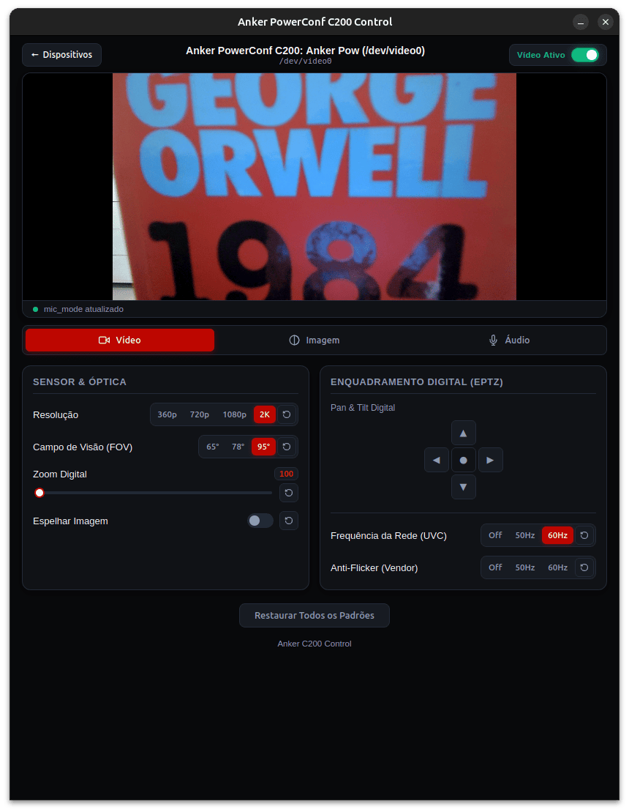
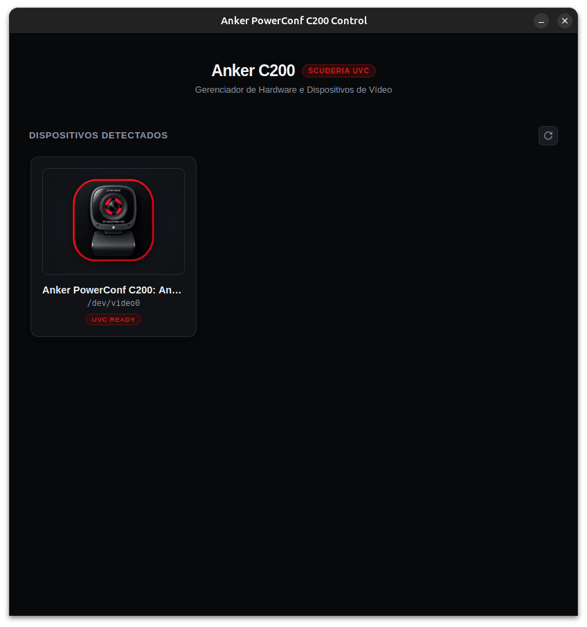
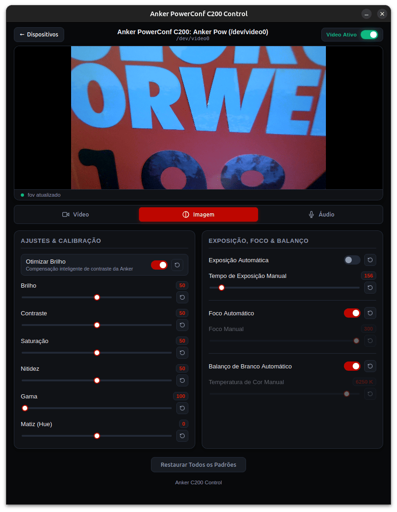
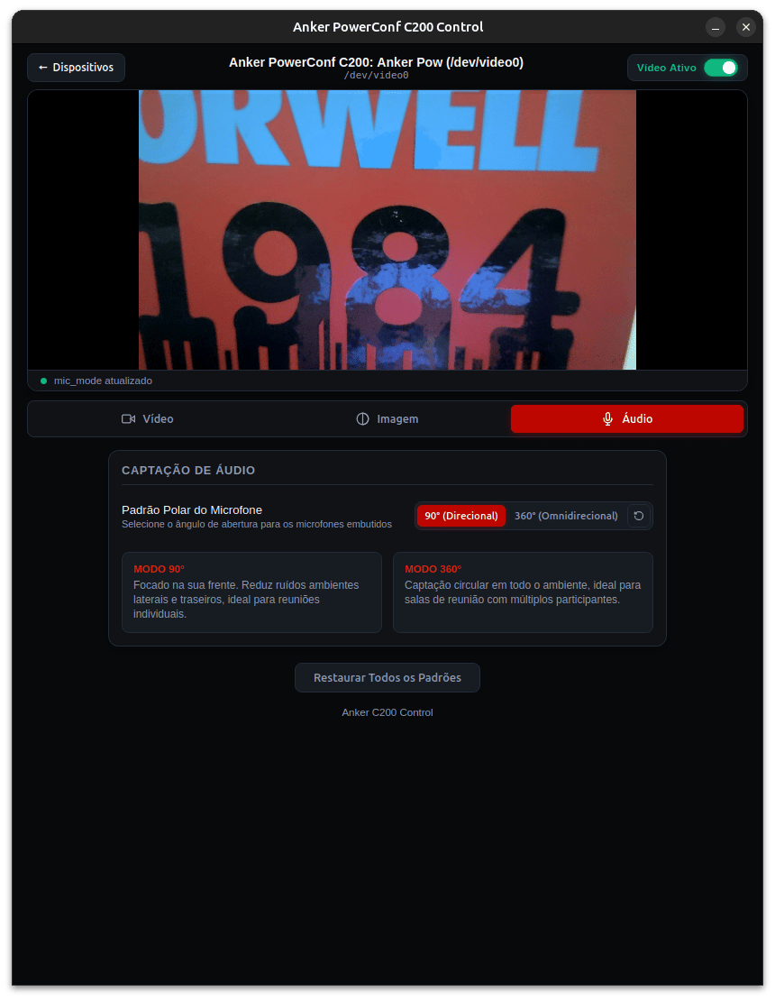

# Anker C200 Control

[](https://www.kernel.org/)
[](https://www.rust-lang.org/)
[](https://en.cppreference.com/w/c/11)
[](https://tauri.app/)
[](LICENSE)

Interface gráfica nativa, moderna e de alto desempenho para gerenciar e calibrar a webcam **Anker PowerConf C200** em sistemas Linux, trazendo paridade total com o software oficial do fabricante e suporte direto ao ecossistema open source.

<p align="center">
  
</p>

---

## Sumário

- [Anker C200 Control](#anker-c200-control)
  - [Sumário](#sumário)
  - [Visão Geral e Motivação](#visão-geral-e-motivação)
  - [Arquitetura e Tecnologias](#arquitetura-e-tecnologias)
  - [Funcionalidades](#funcionalidades)
    - [Gerenciamento de Dispositivos \& Preview](#gerenciamento-de-dispositivos--preview)
    - [Lente, Enquadramento \& Resolução](#lente-enquadramento--resolução)
    - [Processamento de Imagem](#processamento-de-imagem)
    - [Exposição \& Frequência de Rede](#exposição--frequência-de-rede)
    - [Foco \& Balanço de Branco](#foco--balanço-de-branco)
    - [Áudio \& Microfone](#áudio--microfone)
  - [Destaques e Usabilidade](#destaques-e-usabilidade)
  - [Instalação e Uso](#instalação-e-uso)
    - [Download de Pacotes Prontos (Releases)](#download-de-pacotes-prontos-releases)
    - [Pré-requisitos de Compilação (Linux)](#pré-requisitos-de-compilação-linux)
    - [Compilação e Execução](#compilação-e-execução)
  - [Interface](#interface)
  - [Aviso Legal (Disclaimer)](#aviso-legal-disclaimer)

---

## Visão Geral e Motivação

O utilitário oficial de configuração da Anker é disponibilizado exclusivamente para Windows e macOS, deixando usuários de Linux restritos aos padrões de fábrica ou a comandos manuais de terminal. Este projeto foi concebido para eliminar essa barreira com uma aplicação desktop moderna, leve e responsiva.

O backend desta ferramenta se apoia no trabalho de engenharia reversa do projeto [anker-powerconf-c200-linux-tools](https://github.com/erans/anker-powerconf-c200-linux-tools), desenvolvido por Eran Sandler. A partir da análise minuciosa de tráfego USB bruto e captura de pacotes I/O entre o hardware e o software proprietário, foram mapeadas e expostas chamadas de controle antes inacessíveis no projeto, garantindo acesso completo a todos os parâmetros nativos do sensor.

---

## Arquitetura e Tecnologias

A aplicação adota uma arquitetura em camadas focada em máxima velocidade, baixo consumo de RAM e integração profunda com o subsistema de vídeo do Linux:

- **Tauri & Rust**: Núcleo desktop enxuto e seguro. Gerencia o ciclo de vida da aplicação e expõe chamadas IPC rápidas entre o front-end e o backend.
- **C Nativo (C11)**: Mapeamento de baixo nível para extensões UVC (Extension Units) e chamadas `ioctl` diretas sobre o **V4L2** (`/dev/video*`), compilado e vinculado ao Rust via crate `cc`.
- **Vanilla Web Stack (HTML5, CSS3, JavaScript ES6+)**: Front-end puro e sem dependências pesadas de frameworks, assegurando inicialização imediata, baixo footprint de memória e renderização fluida.
- **Design System**: Interface escura com paleta profunda (`#08090b`), superfícies modulares e destaques em vermelho de alta intensidade.

---

## Funcionalidades

### Gerenciamento de Dispositivos & Preview
- **Descoberta Automática de Hardware**: Varredura e listagem em grid das câmeras Anker conectadas ao sistema com identificação de path (`/dev/videoX`).
- **Estado de Conexão**: Feedback visual quando o dispositivo está pronto para uso (*UVC Ready*) ou em caso de desconexão.
- **Live Preview Integrado**: Monitor de vídeo em tempo real via WebRTC/getUserMedia com switch dedicado para ativar ou pausar a visualização.
- **Sincronização Bidirecional**: Ao conectar ou selecionar uma câmera, o estado dos controles é imediatamente lido do hardware via `get_camera_control`.

### Lente, Enquadramento & Resolução
- **Resoluções Nativas**: Alternância dinâmica entre **360p**, **720p**, **1080p** e **2K** (com reinicialização automática do stream de vídeo).
- **Campo de Visão (FOV)**: Seleção ótica rápida entre **65°** (fechado), **78°** (médio) e **95°** (aberto).
- **Controles ePTZ Digitais**:
  - **D-Pad Virtual**: Movimentação manual de Pan e Tilt com limites graduados e botão central para recentralização imediata.
  - **Zoom Digital**: Ajuste contínuo de 100% até 400% (passos de 10%).
- **Otimização Inteligente de Brilho**: Adaptação automatica para equilíbrio de sombras e realces.
- **Espelhamento**: Inversão horizontal de imagem (*horizontal flip*).

### Processamento de Imagem
- **Brilho (Brightness)**: Escala de 0 a 100.
- **Contraste (Contrast)**: Escala de 0 a 100.
- **Saturação (Saturation)**: Escala de 0 a 100.
- **Nitidez (Sharpness)**: Escala de 0 a 100.
- **Gama (Gamma)**: Ajuste linear de curva de luminância de 100 a 300.
- **Matiz (Hue)**: Calibração de matiz em faixa de -180° a +180°.

### Exposição & Frequência de Rede
- **Exposição Automática / Manual**:
  - Modo automático contínuo com chave liga/desliga.
  - Ajuste manual absoluto de tempo de exposição (1 a 2500).
- **Frequência da Rede Elétrica (UVC)**: Redução de flicker padrão UVC em Off, 50Hz e 60Hz.
- **Anti-Flicker Proprietário (Vendor)**: Controle anti-cintilação específico do hardware Anker (Off, 50Hz, 60Hz).

### Foco & Balanço de Branco
- **Foco**:
  - Alternância entre Foco Automático Contínuo e Foco Manual (0 a 255).
- **Balanço de Branco**:
  - Modo Automático com detecção de temperatura ambiente.
  - Calibração Manual por temperatura de cor em Kelvin (2800 K a 6500 K, em passos de 50 K).

### Áudio & Microfone
- **Modo Polar do Microfone**:
  - **90° (Focado)**: Captação direcional para redução de ruídos laterais/traseiros.
  - **360° (Geral)**: Captação omnidirecional para reuniões em grupo ou salas abertas.

---

## Destaques e Usabilidade

- **Gerenciamento Inteligente de Dependências**: Controles manuais (como tempo de exposição, foco e temperatura de cor) são desabilitados visualmente quando o modo automático correspondente está ligado. Mover um controle manual desativa automaticamente o respectivo modo automático.
- **Resets Granulares**: Cada controle possui um botão de reset individual para retornar ao padrão de fábrica daquele parâmetro específico.
- **Restauração Global**: Botão mestre para restaurar todos os parâmetros da câmera simultaneamente.
- **Fila de Comandos IPC**: Execução serializada de instruções para prevenir race conditions ou sobrecarga de chamadas `ioctl` no driver do kernel.

---

## Instalação e Uso

### Download de Pacotes Prontos (Releases)

Para a maioria dos usuários, a forma mais rápida é baixar o executável pré-compilado na aba [Releases](https://github.com/daviroodrigues/anker-c200-ui/releases).

No Ubuntu/Debian, faça o download do arquivo `.deb` e execute:

```bash
sudo dpkg -i anker-c200-ui_*_amd64.deb

```

Caso prefira o executável portátil (`AppImage`), conceda permissão de execução:

```bash
chmod +x anker-c200-ui_*_amd64.AppImage
./anker-c200-ui_*_amd64.AppImage

```

### Pré-requisitos de Compilação (Linux)

Caso vá compilar a partir do código-fonte, certifique-se de possuir as ferramentas de compilação C/C++, Rust e as bibliotecas do Tauri instaladas. No Ubuntu/Debian:

```bash
sudo apt update
sudo apt install -y build-essential curl wget libssl-dev libgtk-3-dev libwebkit2gtk-4.1-dev \
    libayatana-appindicator3-dev librsvg2-dev libudev-dev

```

Garanta também que seu usuário possui permissão de leitura/gravação nos dispositivos de vídeo:

```bash
sudo usermod -aG video $USER

```

*(Faça logout e login novamente para aplicar a alteração de grupo).*

### Compilação e Execução

Clone o repositório e inicie o ambiente de desenvolvimento:

```bash
git clone https://github.com/daviroodrigues/anker-c200-ui.git
cd anker-c200-ui
cargo tauri dev

```

Para gerar o binário de produção otimizado e os pacotes instaláveis:

```bash
cargo tauri build

```

O executável final e os instaladores gerados (`.deb`) estarão disponíveis no diretório `src-tauri/target/release/bundle/`.

---

## Interface

<div align="center">
  <h3>Painel Principal & Live Preview</h3>
  
</div>

<br>

<details open>
  <summary><b>Outras Telas e Controles</b></summary>
  <br>

  <p align="center">
    
    
  </p>
  <p align="center">
    
  </p>
</details>

---

## Aviso Legal (Disclaimer)

Este projeto é um software livre e comunitário, sem qualquer vínculo comercial ou afiliação à Anker Innovations Limited. A referência à marca Anker e ao modelo PowerConf C200 ocorre unicamente para fins de identificação de compatibilidade de hardware.

Todas as marcas registradas pertencem aos seus respectivos proprietários. As implementações de engenharia reversa foram realizadas estritamente para propósitos de interoperabilidade técnica e suporte a dispositivos no ecossistema Linux.
